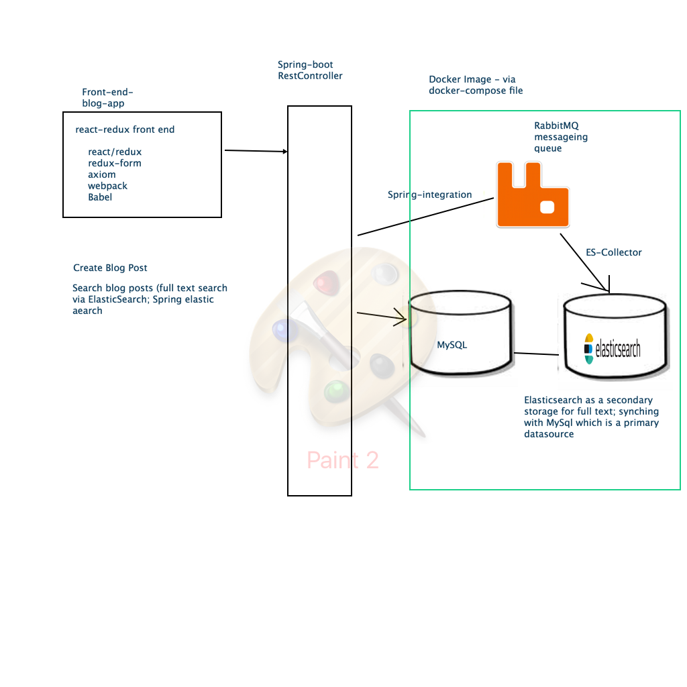

Learning React/Redux was an item on my todo list for a while. I finally get the chance to put together an app using these technlogly stacks.

A React/Redux blog application!!!! Pretty much I re-write the Angular2 blog-application (https://github.com/vhoang55/springboot-jwt-angular2)

I took out the authentication piece of the app. However, I mix in a few other technology to make it more interesting

* React/Redux for front
* rabbitmq (as a message queue to dispatch message to elasticsearch, via spring integration)
* elasticsearch (as a secondary storage for full-text search of the blog entries)
* mysql - as the primary storage for the blog entries; via jpa
* docker-compose - rabbitmq, elasticsearch, mysql are docker images that run via docker container

To run the blog application:

* Download Docker, and cd into /docker, then run: docker-compose up
* Run the Main Blog (Spring boot app com.blog.app.BlogAppMain)
* Run the elasticsearch collector (es.collector.EsEventCollector to pick up event from rabbitmq)
* Finally navigate to blog-app-front-end module to follow the instruction in there.

Enjoy learning!!!
